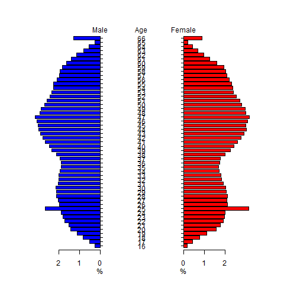
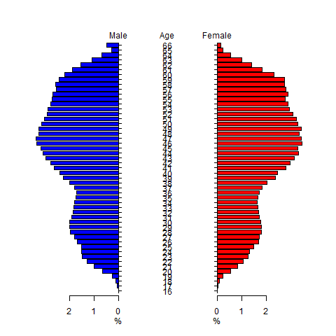
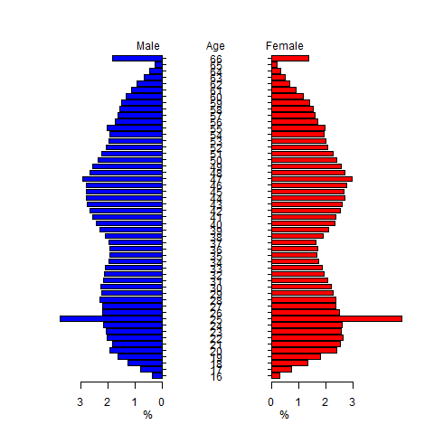
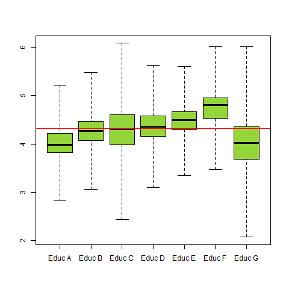
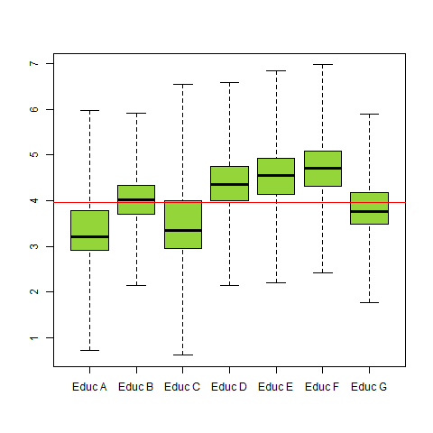
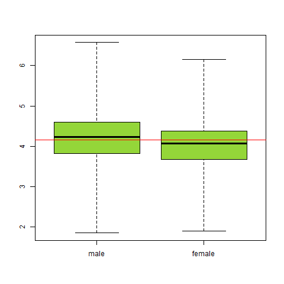
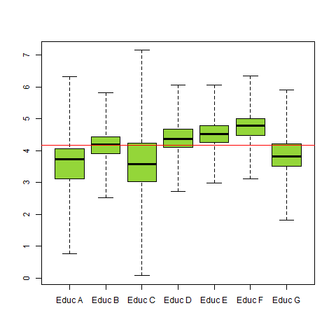

[](http://quantlet.de/)

## [](http://quantlet.de/) **SPLFreqPlot** [](http://quantlet.de/)

```yaml

Name of Quantlet: SPLFreqPlot

Published in:     Union Wage Effects in Germany - Implications for the Wage Distribution

Description:      First part of the descriptive statistics.

Keywords:         descriptive statistics, population pyramid,  boxplot, 

Author:           Felix Boenisch, Nicole Hermann, Max Reinhardt

See also:         SPLDummyRespond, SPLContract, SPLQuantPlot, SPLSumTable, SPLRegAnalysis

Submitted:        friday 18.08.2017, by Felix Boenisch, Nicole Hermann, Max Reinhardt


```
 
 
 
 
 
 
 


### R Code:
```r
#install and load dplyr- and stargazer-package

install.packages("dplyr")

library(dplyr)

install.packages("stargazer")

library(stargazer)


#OLS regression with 4 different specifications

model1 = lm (lnWage ~ SCTariffDummy + FCTariffDummy  + ef10 + east + ef9be + ef12be + ef26be + minimumWage + ef9 + educ2 

             + educ3 + shift + ef40 + agesq + ef41 + expsq + permanent , dat )


model2 = lm (lnWage ~ shareSC + shareFC + ef10 + east + ef9be + ef12be + ef26be + minimumWage + ef9 + educ2 + educ3 + shift 

             + ef40 + agesq + ef41 + expsq + permanent , dat )


model3 = lm (lnWage ~ SCTariffDummy + shareSC + FCTariffDummy + shareFC + ef10 + east + ef9be + ef12be + ef26be + minimumWage 

             + ef9 + educ2 + educ3 + shift + ef40 + agesq + ef41 + expsq + permanent , dat )


model4 = lm (lnWage ~ SCTariffDummy + shareSC + FCTariffDummy + shareFC + shareSCSC + shareFCFC + ef10 + east + ef9be + ef12be 

             + ef26be + minimumWage + ef9 + educ2 + educ3 + shift + ef40 + agesq + ef41 + expsq + permanent , dat )


#output table result in latex code

stargazer(model1, model2, model3, model4, title="Results OLS Regression" ,  

          keep = c("SCTariffDummy", "FCTariffDummy", "shareSC" , "shareFC" , "shareSCSC" , "shareFCFC" , "ef10") , 

          covariate.labels=c("Sectoral Contract","Firm Contract", "share SC","share FC","shareSCxSC","shareFCxFC" , "gender (male = 0)"),

          align=TRUE , omit.stat=c("ser","f"),  no.space=TRUE, out = "olsregression.tex")


###########################################################################################################################

############################################## Quantile Regression #########################################################

###########################################################################################################################

#install and load quantreg-package

install.packages("quantreg")

library(quantreg)


#free up additional memory (only for windows users)

memory.limit(10000)   


#delete NAs from lnwage

quantileRegressionData   = dat %>% filter(!is.na(lnWage)) 


#set quantiles

quantile = seq(0.05, 0.95, by=0.05)   


#Quantile Regression with full data set

modelConditionalQR = rq(lnWage ~ SCTariffDummy + shareSC + FCTariffDummy + shareFC + shareFCFC + shareSCSC + ef10 

                        + east+ ef9be + ef12be + ef26be + minimumWage + ef9 + educ2 + educ3 + shift + ef40 + agesq 

                        + ef41 + expsq + permanent , data=quantileRegressionData, tau = quantile)

quantreg.plot = (summary(modelConditionalQR))


#define a vector of which variables' coefficients should be plotted

plotvar = c(1, 2, 3, 4, 5, 6, 7, 8)  

plot(quantreg.plot, parm=plotvar)


modelConditionalQRCoef = modelConditionalQR[1]

modelConditionalQRCoef = as.data.frame(modelConditionalQRCoef)


#build vector with share for later calculation of the effects

calcAverage = c(lnWageSummaryTotal$TotalEmpolyeeShare[1],      

                lnWageSummaryTotal$TotalEmpolyeeShare[1],

                lnWageSummaryTotal$TotalEmpolyeeShare[2],

                lnWageSummaryTotal$TotalEmpolyeeShare[2])


#build data frame with results from conditional quantile regression

calcAverageCoefCQRSCSCFCFCQR = data.frame(tau10 = c(modelConditionalQRCoef[7, 2],  modelConditionalQRCoef[7, 2],    

                                                    modelConditionalQRCoef[6, 2],  modelConditionalQRCoef[6, 2]),

                                          tau25 = c(modelConditionalQRCoef[7, 5],  modelConditionalQRCoef[7, 5],

                                                    modelConditionalQRCoef[6, 5],  modelConditionalQRCoef[6, 5]),

                                          tau50 = c(modelConditionalQRCoef[7, 10], modelConditionalQRCoef[7, 10],

                                                    modelConditionalQRCoef[6, 10], modelConditionalQRCoef[6, 10]),

                                          tau75 = c(modelConditionalQRCoef[7, 15], modelConditionalQRCoef[7, 15],

                                                    modelConditionalQRCoef[6, 15], modelConditionalQRCoef[6, 15]),

                                          tau90 = c(modelConditionalQRCoef[7, 18], modelConditionalQRCoef[7, 18],

                                                    modelConditionalQRCoef[6, 18], modelConditionalQRCoef[6, 18]))


#calculate average partial effects

averagePartialEffectQR = data.frame(Quantiles = c("Sector Contract (SC)", "shareSC", "Firm Contract (FC)", "shareFC"),

                                    tau10 = modelConditionalQRCoef[2:5, 2]  + (calcAverage * calcAverageCoefCQRSCSCFCFCQR$tau10),    

                                    tau25 = modelConditionalQRCoef[2:5, 5]  + (calcAverage * calcAverageCoefCQRSCSCFCFCQR$tau25),

                                    tau50 = modelConditionalQRCoef[2:5, 10] + (calcAverage * calcAverageCoefCQRSCSCFCFCQR$tau50),

                                    tau75 = modelConditionalQRCoef[2:5, 15] + (calcAverage * calcAverageCoefCQRSCSCFCFCQR$tau75),

                                    tau90 = modelConditionalQRCoef[2:5, 18] + (calcAverage * calcAverageCoefCQRSCSCFCFCQR$tau90))                                                 


#print table in latex code

print(xtable(averagePartialEffectQR, type = "latex"), file = "averagePartialEffectsCQR.tex")


###########################################################################################################################

########################################## Uncondtional Quantil Regression ################################################

###########################################################################################################################

#install and load uqr-package

install.packages("uqr")

library(uqr)


quantile2=c(0.1, 0.25, 0.5, 0.75, 0.9)

modelUnconditionalQR = urq(lnWage ~  SCTariffDummy + shareSC + FCTariffDummy + shareFC + shareFCFC + shareSCSC + ef10 

                           + east + ef9be + ef12be + ef26be + minimumWage + ef9 + educ2 + educ3 + shift + ef40 + agesq 

                           + ef41 + expsq + permanent, data=quantileRegressionData, tau = quantile2 )


#calculate average partial effects for unconditional quantile regression:

modelUnconditionalQRCoef = modelUnconditionalQR[1]

modelUnconditionalQRCoef = as.data.frame(modelUnconditionalQRCoef)


#build data frame with results from unconditional quantile regression

calcAverageCoefUQRSCSCFCFC = data.frame(tau10 = c(modelUnconditionalQRCoef[7, 1], modelUnconditionalQRCoef[7, 1],    

                                                  modelUnconditionalQRCoef[6, 1], modelUnconditionalQRCoef[6, 1]),

                                        tau25 = c(modelUnconditionalQRCoef[7, 2], modelUnconditionalQRCoef[7, 2],

                                                  modelUnconditionalQRCoef[6, 2], modelUnconditionalQRCoef[6, 2]),

                                        tau50 = c(modelUnconditionalQRCoef[7, 3], modelUnconditionalQRCoef[7, 3],

                                                  modelUnconditionalQRCoef[6, 3], modelUnconditionalQRCoef[6, 3]),

                                        tau75 = c(modelUnconditionalQRCoef[7, 4], modelUnconditionalQRCoef[7, 4],

                                                  modelUnconditionalQRCoef[6, 4], modelUnconditionalQRCoef[6, 4]),

                                        tau90 = c(modelUnconditionalQRCoef[7, 5], modelUnconditionalQRCoef[7, 5],

                                                  modelUnconditionalQRCoef[6, 5], modelUnconditionalQRCoef[6, 5]))


#calculate average partial effects

averagePartialEffectUQR = data.frame(Quantiles = c("Sector Contract (SC)", "shareSC", "Firm Contract (FC)", "shareFC"),

                                     tau10 = modelUnconditionalQRCoef[2:5, 1] + (calcAverage * calcAverageCoefUQRSCSCFCFC$tau10),    

                                     tau25 = modelUnconditionalQRCoef[2:5, 2] + (calcAverage * calcAverageCoefUQRSCSCFCFC$tau25),

                                     tau50 = modelUnconditionalQRCoef[2:5, 3] + (calcAverage * calcAverageCoefUQRSCSCFCFC$tau50),

                                     tau75 = modelUnconditionalQRCoef[2:5, 4] + (calcAverage * calcAverageCoefUQRSCSCFCFC$tau75),

                                     tau90 = modelUnconditionalQRCoef[2:5, 5] + (calcAverage * calcAverageCoefUQRSCSCFCFC$tau90))                                                 


#print table in latex code

print(xtable(averagePartialEffectUQR, type = "latex"), file = "averagePartialEffectUQR.tex") 


#calculate confidence intervalls  set for for bootstraping (bigger then 5)

modelUnconditionalQR.BCI = urqCI(modelUnconditionalQR , R=30 , seed = NULL , colour = NULL , confidence = NULL , graph = TRUE , cluster = NULL , BC= FALSE )


```