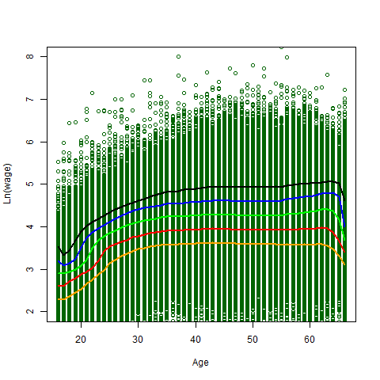
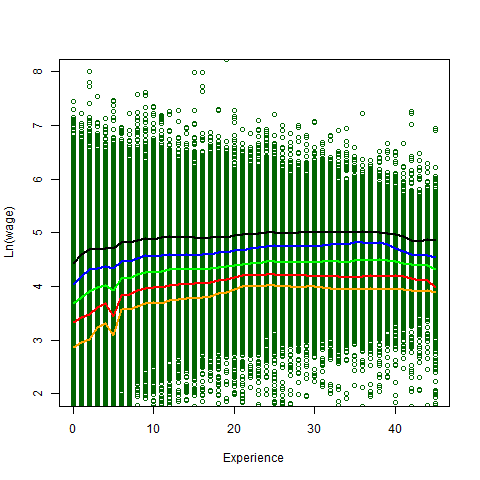
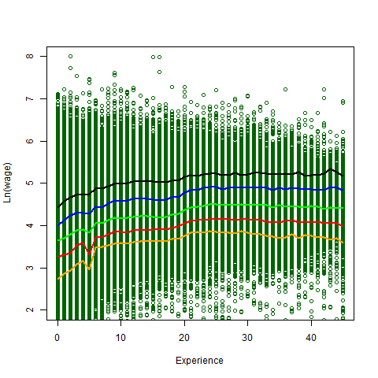
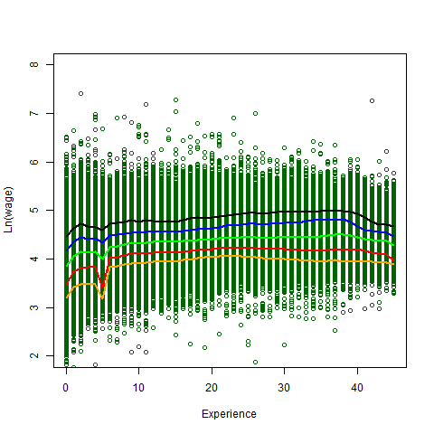

[](http://quantlet.de/)

## [](http://quantlet.de/) **SPLQuantPlot** [](http://quantlet.de/)

```yaml

Name of Quantlet: SPLQuantPlot

Published in:     Union Wage Effects in Germany - Implications for the Wage Distribution

Description:      Second part of the descriptive statistics.

Keywords:         descriptive statistics,  scatterplot,  calculate quantiles, 

Author:           Felix Boenisch, Nicole Hermann, Max Reinhardt

See also:         SPLDummyRespond, SPLContract, SPLFreqPlot, SPLSumTable, SPLRegAnalysis

Submitted:        friday 18.08.2017, by Felix Boenisch, Nicole Hermann, Max Reinhardt

```
 
 
 
 


### R Code:
```r
#Function to calculate quantiles

quant = function(y, x, q){

  if (missing(x))

    stop("No data passed to the function. Variable x has to be defined.")

  if (missing(y))

    stop("No data passed to the function. Variable y has to be defined.")

  if (missing(q))

    stop("No data passed to the function. Variable q has to be defined.")

  if (is.numeric(y)!= TRUE)

    stop("Numeric data needed. y has to be a numeric.")

  if (is.numeric(q)!= TRUE)

    stop("Numeric data needed. Quantile q was wrong specified, 

         q can be either a value or a numeric value.")

  aggregate(y, list(x), na.rm=TRUE, quantile, q)

}


#define a vector with quantiles

q = c(0.10, 0.25, 0.50, 0.75, 0.90) 


#define a vector with used colors

color = c("orange", "red", "green", "blue", "black")


#Function to construct scatterplot with quantile lines

buildquantileplot = function(x, y, xla, yla, plotname){

  if (missing(xla))

    stop("No data passed to the function. Variable xla has to be defined.

         This is a label for the x-axis.")

  if (missing(yla))

    stop("No data passed to the function. Variable yla has to be defined.

         This is a label for the y-axis.")

  if (missing(plotname))

    stop('No data passed to the function.plotname has to be defined such as "graph.pdf".')

  pdf(plotname)

  #plot points

  plot(x, y, ylim=c(2,8), pch = 1, col="dark green", 

       xlab = xla, ylab = yla)

  #plot quantilelines

  for (l in 1:length(q)){

    lines(quant(y, x, q[l]), col = color[l], lwd =2)

  }

  dev.off()

}


#Scatterplot with quantile-lines ln(wage)~age

buildquantileplot(dat$ef41, dat$lnWage, "Age", "Ln(wage)", "scatterplot_lnwage_age.pdf")


#Scatterplot with quantile-lines ln(wage)~experience

buildquantileplot(dat$ef40, dat$lnWage, "Experience", "Ln(wage)", "scatterplot_lnwage_experience.pdf")


#Scatterplot with quantile-lines ln(wage)~experience

buildquantileplot(datFCSC$ef40, datFCSC$lnWage, "Experience", "Ln(wage)", "scatterplotFCSC_lnwage_experience.pdf")


#Scatterplot with quantile-lines ln(wage)~experience

buildquantileplot(datNoFCSC$ef40, datNoFCSC$lnWage, "Experience", "Ln(wage)", "scatterplotNoFCSC_lnwage_experience.pdf")

```